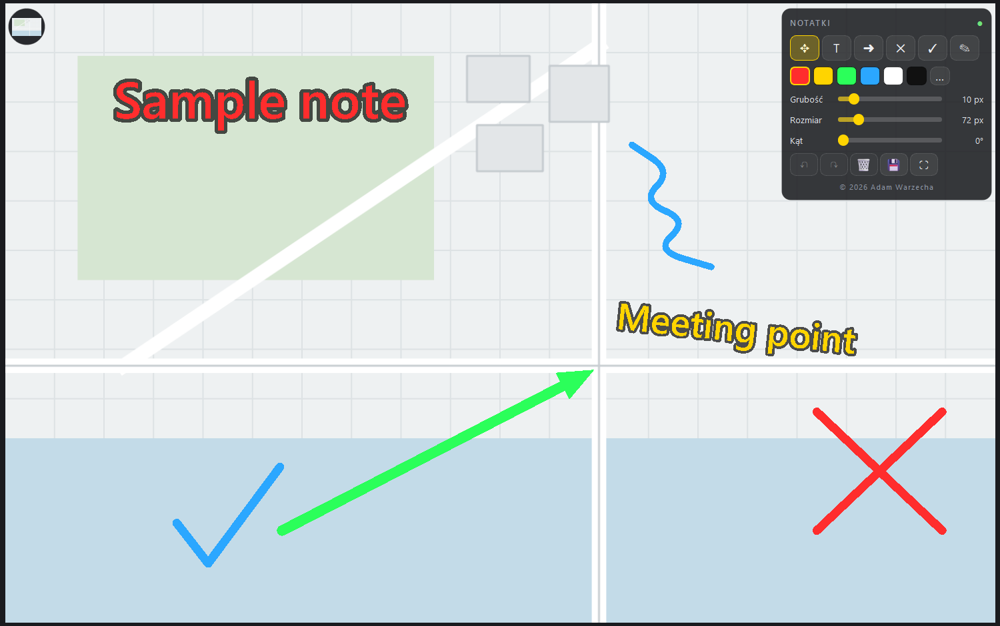

# ImageNotes

Annotate images and very large maps: text, arrows, crosses, checkmarks and
freehand drawing. Windows, Python and Qt 6.



<sub>A large plan with a note, a rotated label, an arrow, a cross, a checkmark and a
freehand stroke. The tool panel floats in the top-right corner and the
recently-edited thumbnail in the top-left; the image gets the whole window.</sub>

## Why it exists

Paint and the usual image editors redraw the whole picture on every frame. On a
10 000 × 8 000 px map that turns into a slideshow, and panning becomes unusable,
which is exactly when you want to mark something up.

ImageNotes keeps a mipmap pyramid and draws only the visible part of the image
from the level closest to the current zoom, so the cost of a frame depends on the
size of the window, not on the size of the image. Panning by right-drag, zooming
under the cursor and drawing all stay fluid at 100% zoom on a 10k image.

| Measured on a 10 234 × 8 314 px map | |
| --- | --- |
| Frame at 100% zoom | 2.4 ms (≈400 FPS) |
| Frame fitted to the window | 4.0 ms |
| Loading + building the pyramid (background thread) | 1.6 s |
| Saving 12 000 × 8 000 px (background thread) | ~3 s, the UI stays responsive |

## Install

**Download `ImageNotes.exe` from the [latest release](https://github.com/Adamowyy/ImageNotes/releases/latest) and run it.**
It is portable: unpack it and run, nothing to install, no Python needed.

Windows may show SmartScreen ("unknown publisher") because the exe is not
code-signed. *More info* → *Run anyway*.

Requirements: 64-bit Windows. **The interface is in Polish.**

## Controls

- **Right mouse button** (hold) pans, **wheel** zooms under the cursor,
  `Ctrl+0` fits the image to the window, arrow keys pan, `F11` toggles full screen.
- Tools: `V` select/move, `T` text, `A` arrow, `X` cross, `C` checkmark,
  `B` freehand. Colour, line width, text size and angle live in the panel in the
  top-right corner; the sliders also edit the annotation you have selected, as one
  undo step per drag.
- `Alt` + drag moves an annotation in any mode, double-clicking a text edits it,
  `Del` deletes the selection, `Ctrl+Z` / `Ctrl+Shift+Z` undo and redo.
- `Ctrl+O` opens an image, `Ctrl+S` saves immediately. You can also drop an image
  onto the window or onto the desktop shortcut.
- The bubble in the top-left corner lists the images you edited recently.

## Saving

Your original image is only ever read. Everything else goes into `workspace/`:

- `<name>-<hash>.png`: the image with the annotations baked in. Rewritten about
  two seconds after the last edit, so there is one working copy instead of a pile
  of files.
- `<name>-<hash>.json`: the annotation list next to it. That is what makes the
  notes editable objects again when you reopen the image, instead of pixels you
  can no longer move.
- `.thumbs/`: thumbnails for the recent-images bubble.

Running from source, `workspace/` and `settings.json` sit in the project
directory. The packaged exe keeps them next to itself (portable) and falls back to
`%LOCALAPPDATA%\ImageNotes` when that directory is read-only.

PNG or JPEG is a one-line choice in `imagenotes/config.py` (`SAVE_FORMAT`). PNG
gives sharper text and stays lossless; JPEG writes far faster and much smaller:
on a 10k map roughly 1 s / 21 MB against 6 s / 145 MB for PNG.

## Layout

```
imagenotes/   window, canvas, annotation model, document, storage, overlays, config
tools/        icon generator, desktop shortcut, exe build, release publishing
tests/        selftest.py, visual_check.py
docs/         screenshot
```

## Running from source

```bash
uv venv --python 3.11 .venv
uv pip install --python .venv/Scripts/python.exe -r requirements.txt
.venv/Scripts/python.exe ImageNotes.pyw
```

`ImageNotes.pyw` runs under `pythonw.exe`, so there is no console window.

## Tests

```bash
QT_QPA_PLATFORM=offscreen python tests/selftest.py       # model, canvas, autosave, 12000x8000
python tests/visual_check.py                            # real window, real fonts
```

The functional suite runs headless and covers the annotation model and hit
testing, 1:1 panning, zoom that keeps the point under the cursor, the undo stack,
autosave and the save queue. The `offscreen` backend has no font database on
Windows, so text renders as empty boxes there. `visual_check.py` opens a real
window for anything that depends on how text looks, and drops screenshots in
`tests/artifacts/`.

Neither suite touches your real `workspace/`.

## Building the exe

```bash
python tools/build_exe.py            # single-file exe + portable ZIP
python tools/build_exe.py --onedir   # folder with the exe, faster start
```

PyInstaller bundles it into `dist/ImageNotes.exe`; the ZIP also holds a short
readme for whoever you send it to.

## License

MIT, see [LICENSE](LICENSE). Not affiliated with anything else; image formats
and Qt belong to their respective owners.

## Polski

**Pobierz `ImageNotes.exe` z [najnowszego wydania](https://github.com/Adamowyy/ImageNotes/releases/latest) i uruchom go.**
Wersja przenośna: rozpakuj, uruchom, nic nie trzeba instalować i nie potrzebujesz
Pythona. Windows może pokazać SmartScreen („nieznany wydawca", bo exe nie jest
podpisany): *Więcej informacji* → *Uruchom mimo to*.

Program do notowania na zdjęciach i mapach o bardzo dużej rozdzielczości:
tekst, strzałki, krzyżyki, checkmarki i rysowanie odręczne. Prawy przycisk myszy
przesuwa po zdjęciu, kółko przybliża pod kursorem, a notatki zapisują się same.

Oryginalne zdjęcie jest **tylko czytane**. Wypalony obraz z notatkami leży
w `workspace/` i jest nadpisywany po każdej edycji, a obok niego plik `.json`
z listą notatek, dzięki temu po ponownym otwarciu zdjęcia edytujesz notatki,
a nie rysunek. Szczegóły i skróty klawiszowe wyżej, w części angielskiej.
